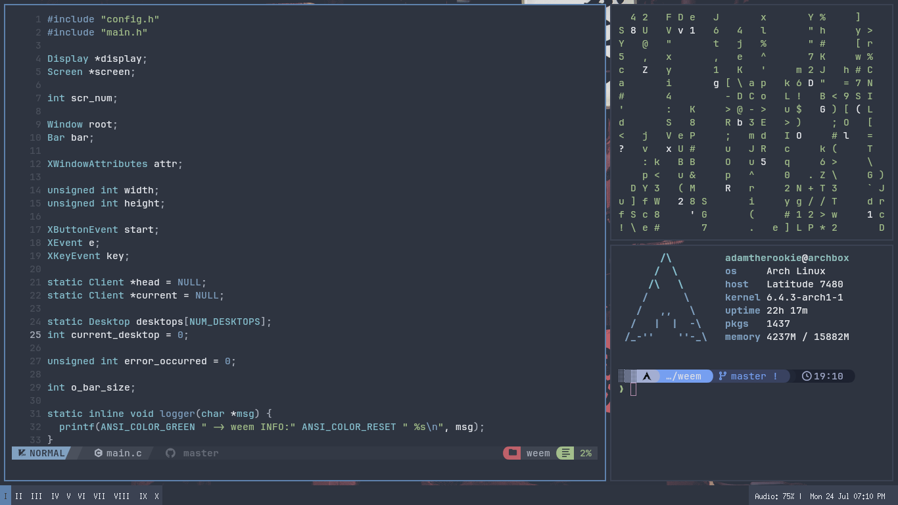

<div style="text-align:center">
<h1>weem</h1>
A small, lightweight, customizable X window manager written in C.
</div>

<hr>


> My weem/weembar config, catppuccin macchiato colorscheme. Open windows: nvim, kitty, htop. Font is Blex Mono Nerd Font (the nerd font version of IBM Plex Mono)

## Features
- Tiling (master and stack)
- Fullscreen
- Multiple Desktops
- Multiple Layouts
- Status Bar
- Autostart script
- Multiple Colorschemes

## Dependencies
weem itself doesn't require any libraries other than X11, however some bar modules need some tools in order to work:
- Audio: `amixer`
- Disk Space: `df`
- CPU Usage: `mpstat`
- Memory Usage: `free`
- Temperature: `sensors`
- Notifications: `dunst`
- Battery: `upower`

## Installing
Clone the repo:
```sh
git clone https://github.com/adamtherookie/weem
```
Copy `config.def.h` to `config.h`:
```sh
cp config.def.h config.h
```
Edit `config.h` to match your preferences. Setup the startup script at `~/.config/weem/autostart.sh`. Make sure you execute `bar.sh` in the background there to update the status bar. For example, a startup script that launches picom and the bar script:

```sh
#!/bin/sh

picom &
path_to_where_you_cloned_weem/bar.sh &
```

You can also edit `bar.sh` to change what is shown in the status bar. 

Then, run the install script (requires root access): `sudo sh install.sh`.

Upon changing the configuration, you need to rerun the install script for the changes to take place. 

> [!NOTE]
> If you have a multi-monitor setup, you have to manually set the width/height of your **entire** display in the `config.h` file (in the `WIDTH` and `HEIGHT` macros).

## Running
- If you use a display manager such as SDDM or LDM, copy `weem.desktop` to `/usr/share/xsessions`
- If you prefer to use `startx`, add `exec weem` to the end of your `xinitrc`

## Default Keybindings
| Key | Action |
|-----|--------|
| Super + Enter | Spawn terminal |
| Super + Q | Spawn web browser |
| Super + D | Spawn application launcher |
| Super + W | Close window |
| Super + G | Screenshot |
| Super + Up | Move up in list |
| Super + Down | Move down in list |
| Super + Right | Increase master size |
| Super + Left | Decrease master size |
| Super + F | Make window fullscreen |
| Super + T | Make window tiled |
| Super + S | Make window floating |
| Super + Shift + T | Set layout to master + stack |
| Super + Shift + V | Set layout to vertical stripes |
| Super + Shift + H | Set layout to horizontal stripes |
| Super + B | Toggle bar |
| Super + Shift + B | Toggle bar position |
| Super + K | Kill weem |
| Super + NUM_KEY | Switch to desktop |
| Super + Shift + NUM_KEY | Send window to desktop |

## Thanks
A big thanks to these awesome people and projects without which weem wouldn't exist:
- [clarawm](https://github.com/dacousb/clarawm) by [@dacousb](https://github.com/dacousb)
- [swm](https://github.com/SollyBunny/swm) by [@SollyBunny](https://github.com/SollyBunny)
- [dwm](https://dwm.suckless.org/) by suckless
